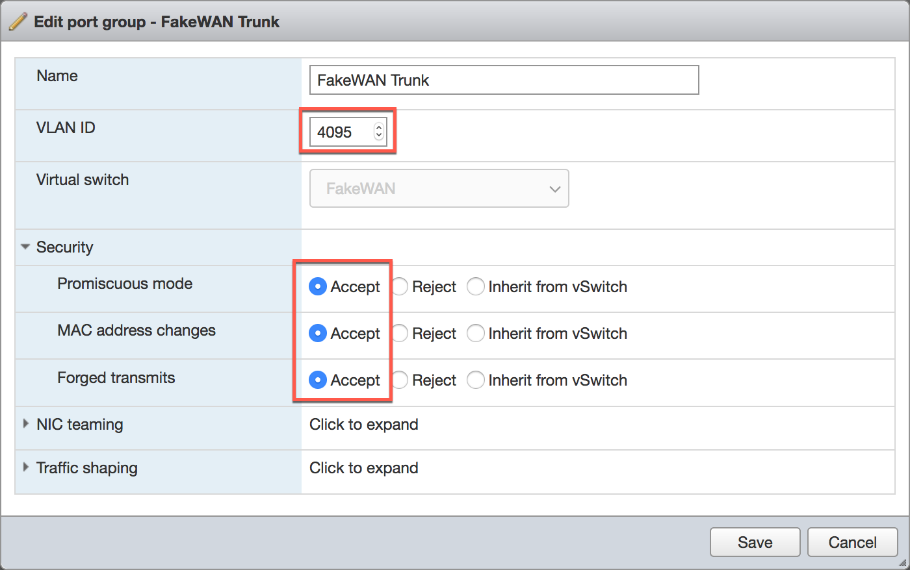
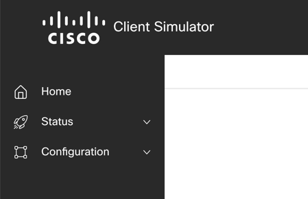
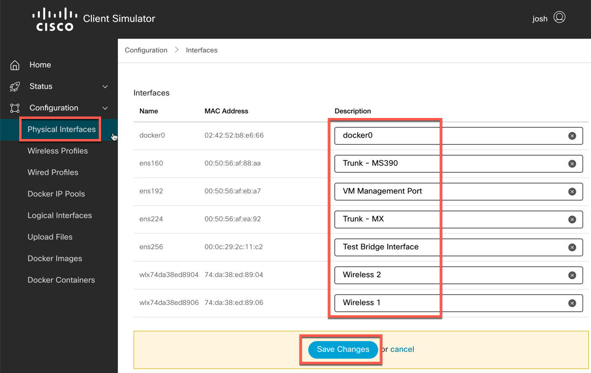
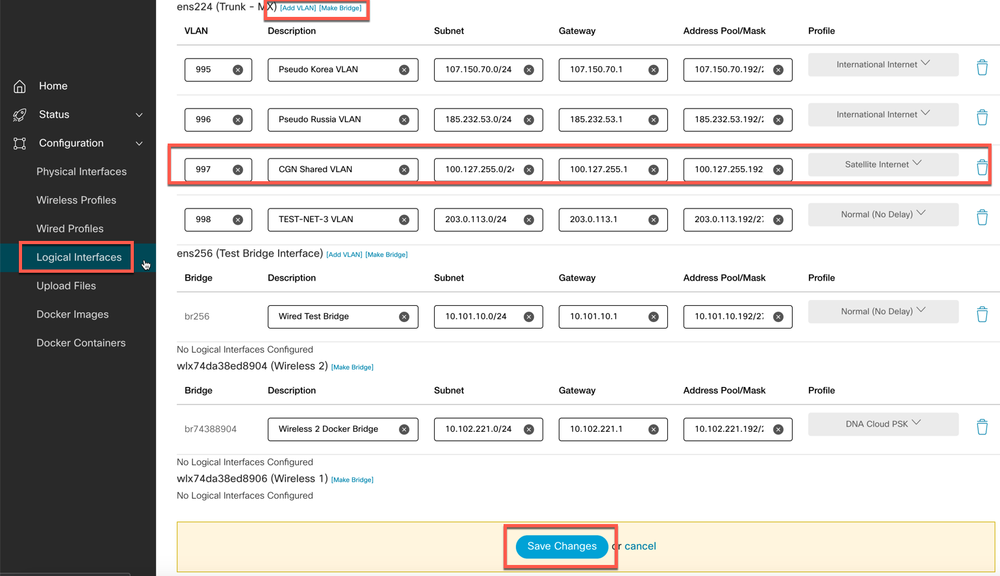
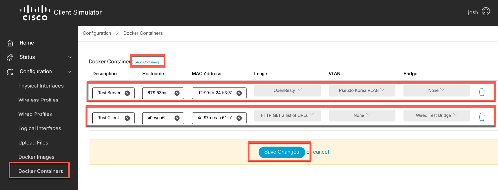

# clientsim


## Getting Started
* Make sure you have Python3, pip, and virtualenv installed. You'll also need docker. If you are going to be working with the API via cURL, we recommend install 'jq' as well.
    ```
    sudo apt install python3 python3-pip python3-virtualenv docker.io jq wpasupplicant wireless-tools
    ```
* Start docker and enable at boot-time
    ```
    sudo systemctl start docker
    sudo systemctl enable docker
    ```
* Pull down the repo and initialize application. Note: Python needs to be run as root since we are manipulating system parameters.
    ```
    git clone https://github.com/joshand/clientsim.git
    cd clientsim/
    virtualenv venv --python=python3
    source venv/bin/activate
    pip install -r requirements.txt
    python manage.py makemigrations
    python manage.py migrate
    python manage.py createsuperuser
    Username (leave blank to use 'username'): admin
    Email address: email@domain.com
    Password: 
    Password (again): 
    Superuser created successfully.
    
    python manage.py drf_create_token admin
    Generated token 1234567890abcdefghijklmnopqrstuvwxyz1234 for user admin
    ```
    Configure MEDIA_ROOT in settings.py - this defines where uploaded files go.
    ```  
    python manage.py loaddata import.json
    sudo ./venv/bin/python manage.py runserver 127.0.0.1:8000     (note: if you want this to be reachable externally, use the actual IP address of your client)
    ```
 
Navigate to http://127.0.0.1:8000/ and log in with your superuser account.

## Using the Client Simulator
Note: If you plan on doing VLAN Trunking and running this inside of VMware, you will need to ensure that your VMware networks are configured properly.
    1) Ensure that your VLAN ID is set to 4095
    2) Ensure that your Port Group Security (or vSwitch) is set to Accept Promiscuous mode, MAC address changes and Forged transmits
    

1) Launch the web interface


2) (Optional) Give your physical interfaces easy to remember descriptions


3) Configure Logical Interfaces (Bridges or VLANs), along with IP settings for each (ensure that you do not use duplicate default gateways - Docker does not allow this)


4) Create containers - there are a couple of built in images to get you started; you can create your own in the "Docker Images" section. Select a VLAN or Bridge for each container, click Save Changes when done.

